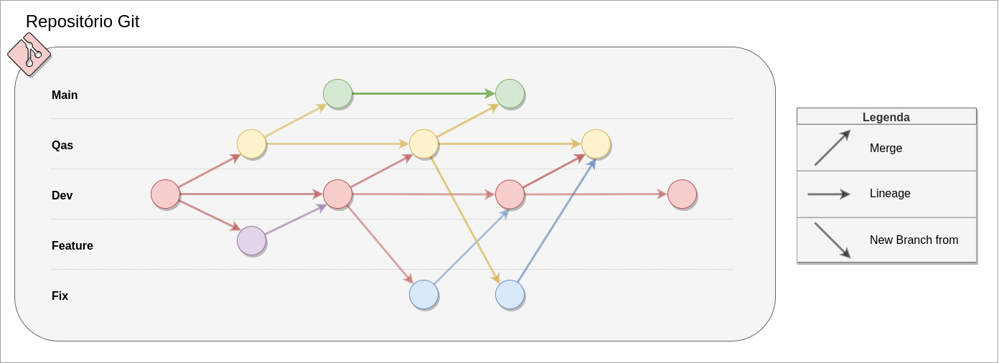

# 1. Git Flow

Este documento tem o objetivo de consolidar padrões de uso do Git no desenvolvimento de nossa aplicação.

***

## 1.1. Motivação

Conforme nomeação do documento, neste projeto usaremos uma adaptação do padrão **git flow**. Este conceito tem seu fundamento na organização de repositórios, atribuindo políticas de uso e restrições de segurança, sempre com o objetivo de cumprir com as práticas mais adequadas, observadas e aperfeiçoadas ao longo do tempo.

***

## 1.2. Políticas de Contribuição

***

### 1.2.1. Idioma

Por se tratar de um projeto universitário do Brasil, por padrão, usaremos o idioma nativo, **Português**. Porém, sabe-se que a área de engenharia de software possui muitos conteúdos e termos em outros idiomas, como o próprio *git flow*, portanto, também será aceito o uso de **terminologias** no idioma **Inglês**.

***

### 1.2.2. Ética

O projeto espera do colaborador bom senso na escrita, além de não permitir a produção de contribuições com linguagem ofensiva. A proposta perpassa pela interação direta com a vivência e moradia de pessoas, portanto também assume-se o compromisso de não violar o respeito em qualquer aspecto, sobretudo étnico racial, religião e sexualidade.

***

## 1.3. Branches

### 1.3.1. Fluxo de Branches

Para garantir um fluxo de trabalho contínuo e de forma padronizada, possibilitando o rastreamento das funcionalidades desenvolvidas e facilitando o desenvolvimento contínuo. Os conceitos-chave para implementação da estratégia serão:

- `Main`: Branch de **produção**, responsável por abrigar o código do último release.
- `Qas`: Branch de **verificação**, representa uma etapa intermediária entre o processo de desenvolvimento e produção. Nesta etapa são realizados os eventuais testes e revisões que antecedem o processo de deploy.
- `Dev`: Branch de **desenvolvimento**, tem a função e prioridade de ser a branch mais atualizada, a qual os desenvolvedores utilizarão como ponto de partida para desenvolver as *features branches*.
- `Feature`: Branch de desenvolvimento de **funcionalidade**, representa a branch de trabalho sob uma determinada funcionalidade, tarefa, correção de bugs e afins.
- `Fix`: Branch de **correção**, possibilita aos desenvolvedores corrigirem eventuais funcionalidades quebradas.

#### 1.3.1.1. Exemplo do Fluxo de Branches

Abaixo segue a ilustração do fluxo:

  
**Figura 1: Fluxo de Branches**

Autor: Calculus Team

### 1.3.2. Nomenclatura de Branch

É importante que a branch de **funcionalidade** seja criada seguindo o padrão:

- **(número-da-issue)-(nome-da-issue)**

Ela deve ser criada a partir da branch de desenvolvimento `Dev` e deve-se trocar os espaços no nome para '-'.

A branch de **correção** deve ser criada no padrão:

- **fix#(número-da-issue)/nome-da-issue**

Ela deve originar-se da branch que apresentou o erro, exceto se for a branch `Main`. Em caso de exceção, deve-se criar uma branch a partir de `Dev`.

## 1.4. Commits

As informações abaixo referem-se aos padrões de escrita de commits do nosso repositório:

### 1.4.1. Commits Atômicos

Sempre dividir o trabalho em **pequenos e significativos commits**, de maneira que cada commit implemente apenas uma funcionalidade.

### 1.4.2. Anatomia do Commit

Na estrutura do padrão convencionado, possuímos as variáveis **tipo**, **número da issue**, **assunto** e **corpo**. A anatomia do commit deve seguir o formato determinado abaixo:

```
[tipo](#número da issue): assunto 
> corpo
```

#### 1.4.2.1. Observações

> As opções permitidas para o campo `tipo` são:

- `feat`: nova funcionalidade
- `docs`: relacionado à documentação
- `refact`: refatoração de código
- `test`: adicionar/refatorar testes
- `fix`: correções

> As regras para o campo `assunto` são:

- Mensagem curta e sucinta
- Todo texto deve estar sempre em letras minúsculas

> As regras para o campo `corpo` são:

- Máximo de 100 caracteres
- Detalhar minimamente as novas alterações
- Deve conter `o que` e `por que` foi feito

### 1.4.3. Exemplo de Commit

Abaixo segue um exemplo de commit feito no padrão do projeto:

```git
[refact](#25): ajustando página de login  
Refatoração do método de login pois a execução estava muito lenta. 
```

***

## 1.5. Pull Request

### 1.5.1. Passo 1

Por meio do processo de **pull request**, realizado no GitHub, toda nova funcionalidade deve ser integrada à branch de desenvolvimento, seguindo o fluxo `Feature -> Dev`.

### 1.5.2. Passo 2

Uma vez que a branch de desenvolvimento esteja com todos os artefatos necessários para se fazer deploy, deve-se criar um pull request de `Dev -> Qas`.

### 1.5.3. Passo 3

A branch de validação (`Qas`) deve ser **revisada por todos os membros antes de realizar o merge para a branch `Main`**. Desta forma, pode-se adicionar mais uma camada de validação pré-deploy e conferir mais assertividade nas entregas. Após concluir a validação:

> Dentre as atividades obrigatórias de um pull request, estão a **revisão em pares** da entrega e **ajuste de eventuais conflitos**.

> O colaborador que abrir o pull request **não pode mergear o mesmo sem revisões de terceiros**.

Para publicar uma nova versão estável da aplicação na branch `Main`, é necessário realizar um **Pull Request** da branch `Qas` para a `Main`. Assim, é garantida a revisão da nova versão do código.

### 1.5.4. Nomenclatura

Toda branch deve estar necessariamente relacionada a uma funcionalidade ou correção, logo a uma _Issue_. O nome da branch deve estar em PORTUGUÊS seguindo o padrão:

- Para funcionalidades: `feat#(número-da-issue)/descrição-curta`
- Para correções: `fix#(número-da-issue)/descrição-curta`

**Exemplo:** `feat#75/criar-jornada`

***

## 1.6. Templates

Aqui estão os templates sugeridos para o guia de contribuição, cobrindo **User Stories**, **Pull Requests** e **Issues**. Esses templates podem ser usados para garantir que as contribuições ao projeto *Calculus* sejam consistentes e bem documentadas.

### 1.6.1. User Story Template

#### 1.6.1.1. Título:
```
US$ - Nome da User Story
```

#### 1.6.1.2. Descrição:
```
**Contexto:**  
Como [tipo de usuário], eu quero [ação desejada] para [objetivo/motivo].

**Tarefas:**
- [ ] Tarefa 1: Detalhe a primeira tarefa que precisa ser concluída.
- [ ] Tarefa 2: Detalhe a segunda tarefa, se aplicável.
- [ ] Tarefa 3: Detalhe outras tarefas necessárias.

**Critérios de Aceitação:**
- [ ] Critério 1: Detalhe o primeiro critério que deve ser atendido para que a história seja considerada completa.
- [ ] Critério 2: Detalhe o segundo critério, se aplicável.
- [ ] Critério 3: Detalhe qualquer outro critério necessário.
```

#### 1.6.1.3. Exemplo:
```
**Título: US04 - Criar Jornada**  

Como professor, eu quero criar uma nova jornada educacional para organizar meus conteúdos.

**Tarefas:**
- [ ] Implementar a interface de criação de jornada.
- [ ] Conectar a interface ao backend para salvar a nova jornada.
- [ ] Testar a funcionalidade com diferentes tipos de dados.


**Critérios de Aceitação:**
- [ ] O professor deve poder acessar a funcionalidade de criação de jornada a partir do dashboard.
- [ ] O formulário de criação de jornada deve incluir campos para título, descrição e trilhas associadas.
- [ ] A nova jornada deve ser salva no banco de dados e refletida na interface.

```

***

### 1.6.2. Pull Request Template

#### 1.6.2.1. Título:
```
[Tipo de mudança] Adiciona/modifica [funcionalidade/bugfix] - #[ID da user story ou issue]
```

#### 1.6.2.2. Descrição
```
Este Pull Request implementa/modifica [descrição da funcionalidade ou correção] conforme descrito na user story ou issue #[ID da user story ou issue].
```

#### 1.6.2.3. Revisão
```
- [x] Descreve a tarefa principal realizada (ex: Cria interface para a nova funcionalidade).
- [x] Detalha outras alterações relevantes (ex: Implementa validações necessárias).
```

#### 1.6.2.4. Pre-merge checklist
```
- [x] O Pull Request refere-se a um único assunto, com um título claro e uma descrição em frases gramaticalmente corretas e completas.
- [x] A branch está atualizada com a branch main.
- [x] Os commits atendem ao padrão especificado na política de contribuição.
```

#### 1.6.2.5. Exemplo:
```
**Título:**  
[Feature] Adiciona funcionalidade de criação de jornada - #42

**Descrição:**  
Este Pull Request implementa a funcionalidade de criação de jornadas para professores, conforme descrito na user story #42.

**Revisão:**
- [x] Cria interface de criação de jornada.
- [x] Implementa validações de unicidade do título.

**Pre-merge checklist:**
- [x] O Pull Request refere-se a um único assunto, um título claro e uma descrição em frases gramaticalmente corretas e completas.
- [x] A branch está atualizada com a branch main.
- [x] Os commits atendem o padrão especificado na política de contribuição.
```

***
## 1.7. Histórico de Versões

| Versão | Data | Descrição | **Autore(s)** |
|--------|:------:|:-----------:|:-------------------:|
| 1.0 | 04/02/2024 | Criação do documento | Natanael Fernandes |
| 1.1 | 08/07/2024 | Atualização de documento e diagrama | Paulo Gontijo |
| 1.2 | 01/09/2024 | Adição de teamplates | Paulo Gontijo |

