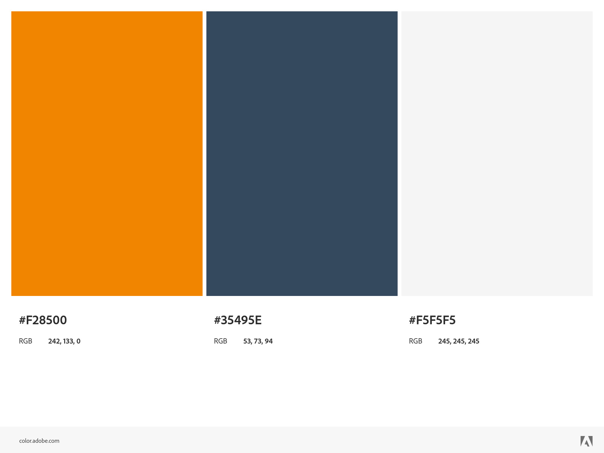
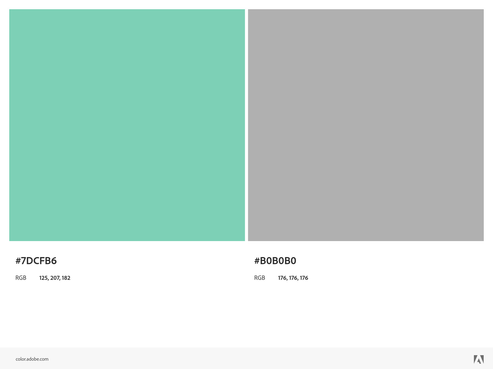
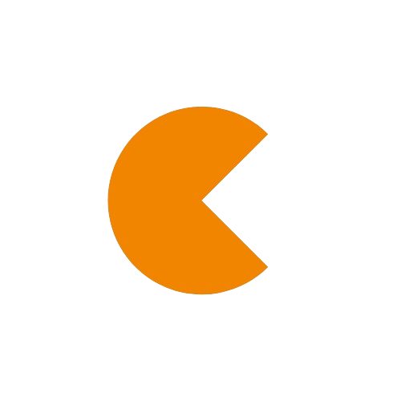

# Guia de Estilo

Este guia apresenta a identidade visual do produto desenvolvido neste projeto, que deve ser seguida ao desenvolver a interface de usuário do sistema.

## 1. Fonte

A fonte escolhida foi a __Roboto__, uma tipografia _sans-serif_ desenvolvida pelo Google. Lançada em 2011, a Roboto foi inicialmente criada como a fonte padrão para o sistema operacional Android, mas desde então se tornou popular em diversos outros contextos devido à sua clareza e legibilidade.
Roboto é uma fonte de código aberto, disponível sob a licença Apache, o que permite seu uso livre em projetos comerciais e pessoais.

### 1.1. Tipografia e Espaçamento

Este exemplo de escala de tipo, extraído do Material Design, usa a fonte Roboto para todos os títulos, legendas, corpo e legendas, criando uma experiência tipográfica coesa. A hierarquia é comunicada por meio de diferenças no peso da fonte (leve, média, regular), tamanho, espaçamento entre letras e maiúsculas e minúsculas.

## 2. Paleta de Cores

### 2.1. Cores Primárias

#### 2.1.1. Laranja Vibrante
Um tom de laranja vibrante, energizante e chamativo, ideal para chamar a atenção e adicionar uma sensação de entusiasmo ao design.

#### 2.1.2. Azul Escuro
Um tom de azul escuro, que transmite confiança e seriedade, sendo ideal para elementos que precisam de destaque sem perder a sobriedade.

#### 2.1.3. Cinza Claro 
Um tom de cinza muito claro, quase branco, que pode ser usado como cor de fundo para criar contrastes suaves e manter a limpeza visual.

### 2.2. Cores Secundárias

#### 2.2.1. Verde Menta
Um tom de verde menta, que traz frescor e modernidade, ideal para destacar elementos sem ser muito agressivo visualmente.

#### 2.2.2. Cinza Médio
Um tom de cinza médio, versátil e neutro, perfeito para equilibrar e complementar as outras cores da paleta.

## 3. Logo
A logo representa um "C", de Calculus, porém seu design rebusca traços baseados em formas geométricas. Além disso a logo faz referência ao jogo Pac-Man, pelo fato de o produto aplicar gamificação na jornada do usuário aluno.

|**Data**|**Descrição**|**Autor(es)**|
|--------|-------------|--------------|
|15/07/2024| Criação do documento | João Victor Max, Paulo Henrique Gontijo |

