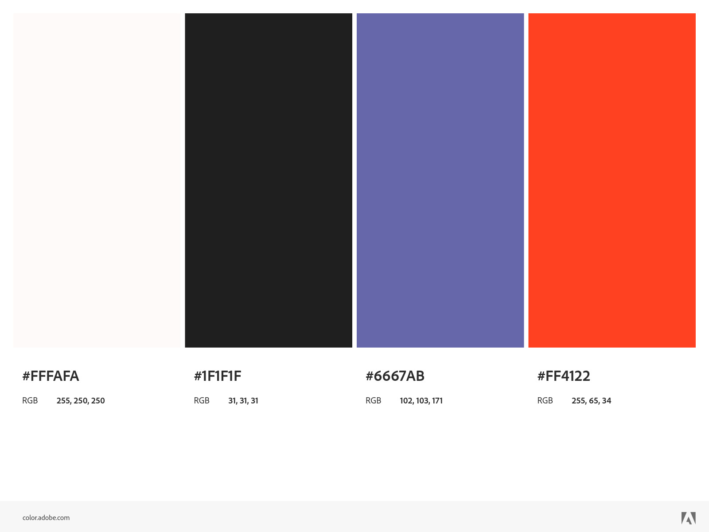

# Guia de Estilo

Este guia apresenta a identidade visual do produto desenvolvido neste projeto, que deve ser seguida ao desenvolver a interface de usuário do sistema.

## 1. Fonte

A fonte escolhida foi a __Roboto__, uma tipografia _sans-serif_ desenvolvida pelo Google. Lançada em 2011, a Roboto foi inicialmente criada como a fonte padrão para o sistema operacional Android, mas desde então se tornou popular em diversos outros contextos devido à sua clareza e legibilidade.
Roboto é uma fonte de código aberto, disponível sob a licença Apache, o que permite seu uso livre em projetos comerciais e pessoais.

### 1.1. Tipografia e Espaçamento

Este exemplo de escala de tipo, extraído do Material Design, usa a fonte Roboto para todos os títulos, legendas, corpo e legendas, criando uma experiência tipográfica coesa. A hierarquia é comunicada por meio de diferenças no peso da fonte (leve, média, regular), tamanho, espaçamento entre letras e maiúsculas e minúsculas.

## 2. Paleta de Cores

## 3. Logo

## 4. Ícones
Os ícones vão seguir o [Material Icons](https://mui.com/material-ui/material-icons/)

|**Data**|**Descrição**|**Autor(es)**|
|--------|-------------|--------------|
|15/07/2024| Criação do documento | João Victor Max, Paulo Henrique Gontijo |
|07/08/2024| Alteração do documento | João Victor Max |

