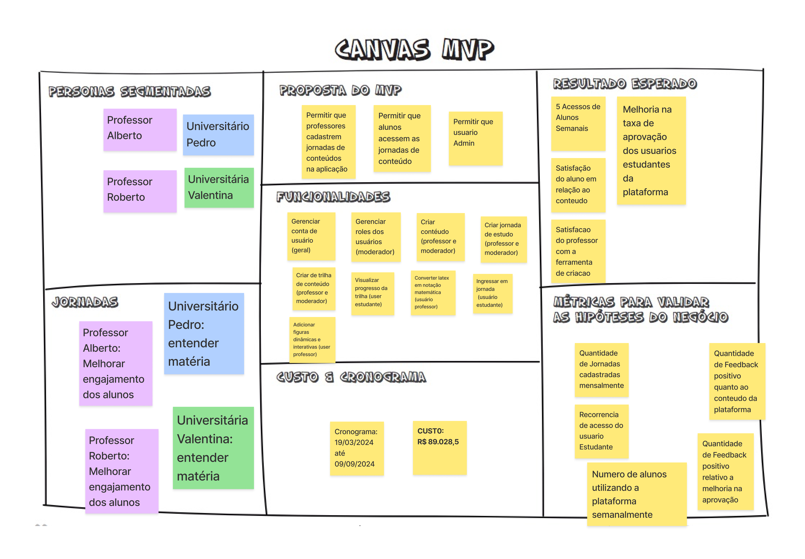

# Canvas MVP: Alinhando Estratégias e Definindo o Produto Mínimo Viável

## 1. Definição

O Canvas MVP é uma ferramenta visual essencial que auxilia a equipe a alinhar e definir a estratégia do MVP (Produto Mínimo Viável). O MVP representa a versão mais simples do produto que pode ser disponibilizada para o negócio, mantendo a funcionalidade necessária para ser efetivamente utilizado e validado pelo usuário final. O uso do Canvas MVP facilita o planejamento e a identificação dos elementos essenciais do produto, garantindo que o produto viável atenda às necessidades do negócio e dos usuários.

## 2. Metodologia

Após a definição do MVP, empregamos um quadro para apresentar tudo o que foi concebido (canvas MVP). Esse quadro é subdividido em 7 seções, cada uma encarregada de conter informações como:

1. **Proposta do MVP**
2. **Personas**
3. **Jornadas**
4. **Funcionalidades**
5. **Resultados esperados**
6. **Métricas para validar as hipóteses do negócio**
7. **Estimativa de custos e Cronograma**

## 3. Resultado

Seguindo as orientações para a elaboração do canvas, a equipe se reuniu em 2 grupos e criou 2 versões diferentes utilizando os artefatos gerados nas etapas anteriores ao canvas. Com isso, depois de discussões e ajustes, foi possível criar o quadro, apresentado abaixo:

|**Data**|**Descrição**|**Autor(es)**|
|--------|-------------|--------------|
|05/07/2024| Criação do Documento | Davi Matheus, Natanael Filho e João Victor |

