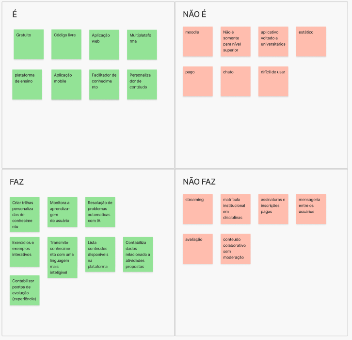

# É, Não é, Faz, Não faz

## 1. Definição
A atividade __É - Não É - Faz - Não Faz__ ajuda a definir um tópico (seja um produto, um processo ou uma estratégia). Por vezes, é mais fácil descrever algo pelo que tal coisa não é ou deixa de fazer. Essa atividade busca clarificações desta forma, indagando, especificamente, cada aspecto positivo e negativo sobre ser ou fazer algo.

Nessa etapa do Lean Inception, a equipe trabalha em conjunto para definir com clareza os limites do produto ou projeto. Isso é crucial para evitar dúvidas e garantir que todos estejam alinhados sobre o que está incluso e o que não está no escopo.

## 2. Resultado

## 3. Referências

> Lean Inception - Como alinhar pessoas e construir o produto certo. Paulo Caroli.

## 4. Histórico de versão

|**Data**|**Descrição**|**Autor(es)**|
|--------|-------------|--------------|
|08/05/2024| Criação do Documento | Kauã Seichi |
