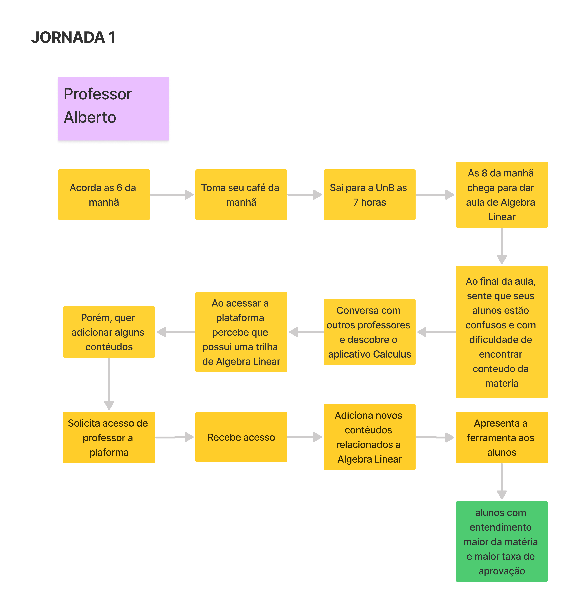
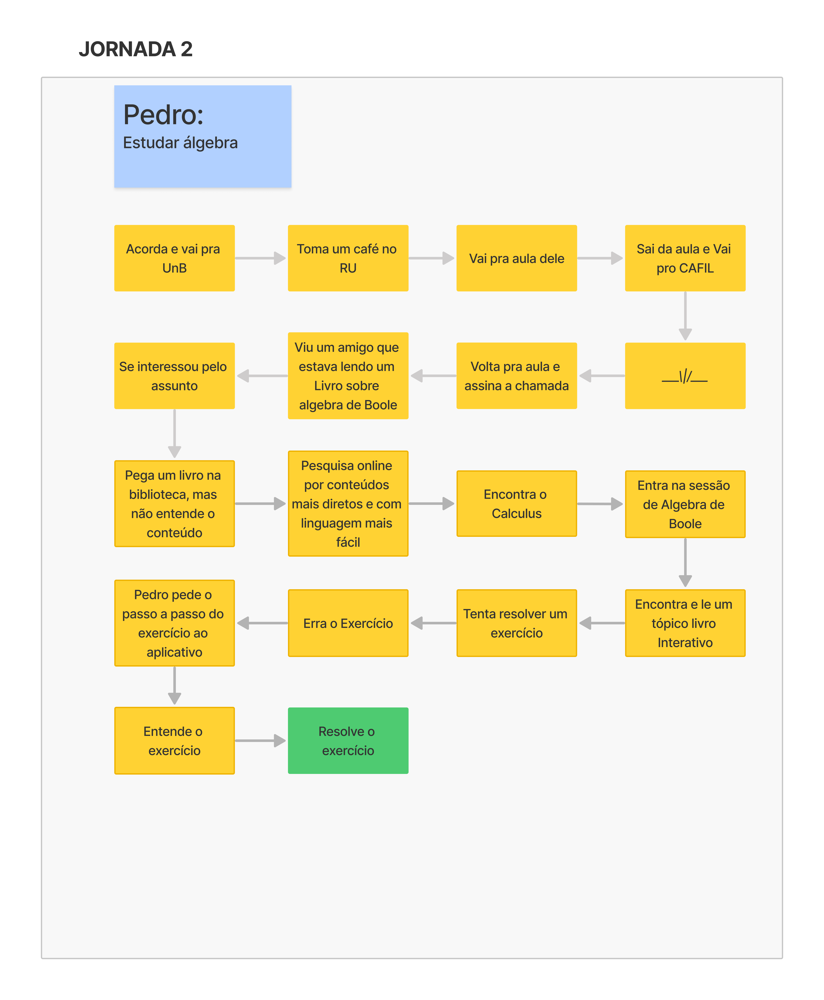
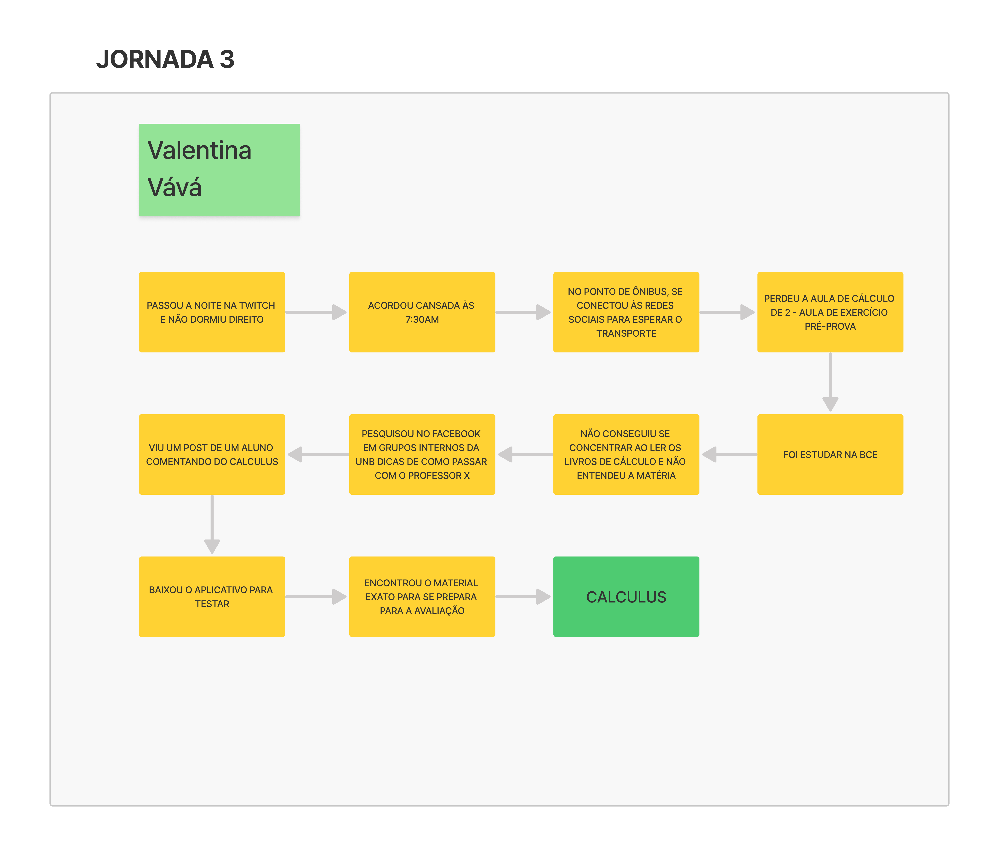
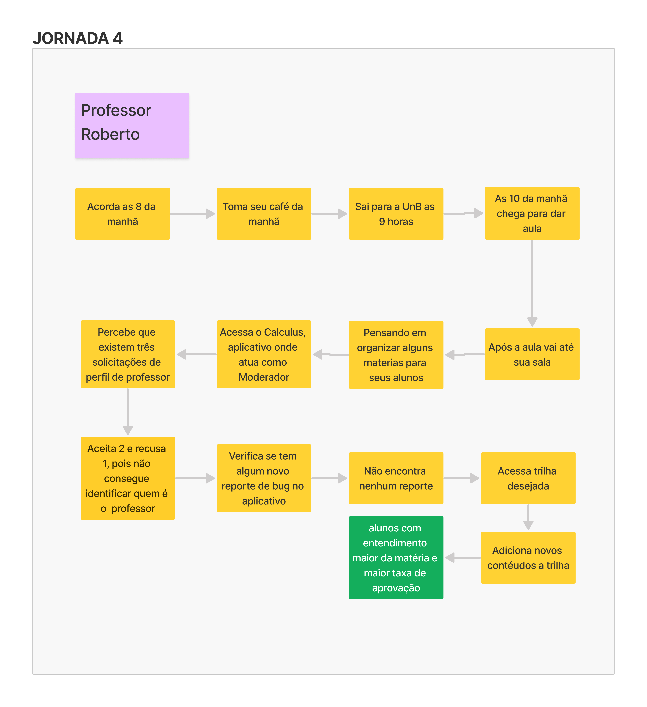

# Jornada de Usuário

## 1. Definição

A atividade de definição de jornadas de usuário descreve o percurso de um usuário através de uma sequência de passos para alcançar um objetivo. Alguns desses passos representam diferentes pontos de contato com o produto, caracterizando a interação do usuário com ele. À medida que construímos a jornada, a equipe levanta questões e opiniões sobre os desejos do usuário e as funcionalidades do produto.

O nível de detalhamento de uma jornada deve ser equilibrado, evitando extremos. A jornada deve proporcionar um passo a passo claro da interação do usuário, mas também funcionar como uma síntese simplificada do fluxo, excluindo informações redundantes e detalhes excessivos.

## 2. Resultado

### Jornada do Professor Alberto

### Jornada do Pedro

### Jornada da Vává

### Jornada do Professor Rispoli

## 3. Referências

> Lean Inception - Como alinhar pessoas e construir o produto certo. Paulo Caroli.

## 4. Histórico de versão

|**Data**|**Descrição**|**Autor(es)**|
|--------|-------------|--------------|
|02/07/2024| Criação do Documento | Davi Matheus |