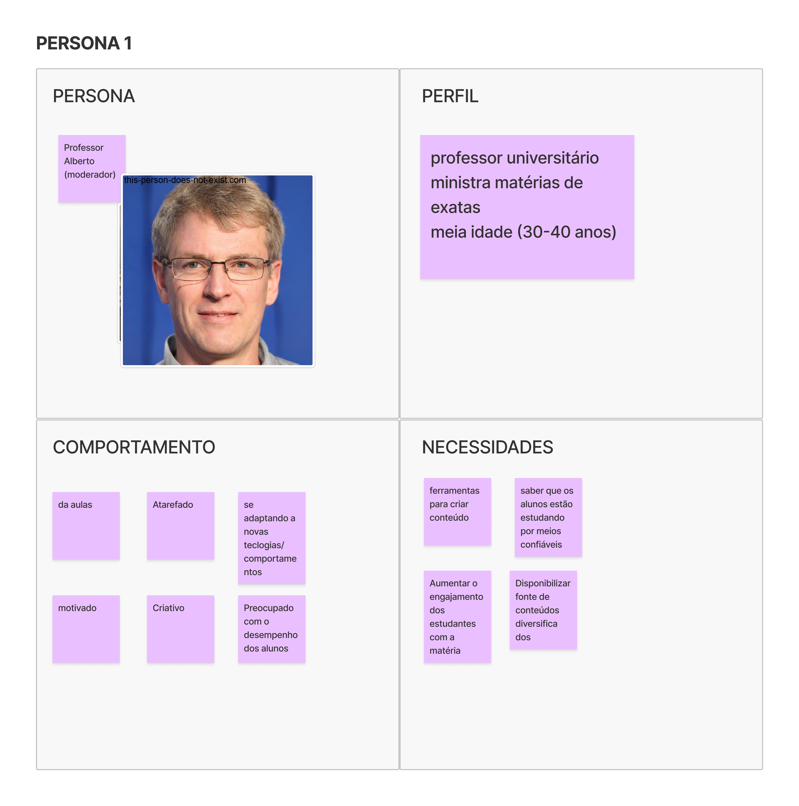
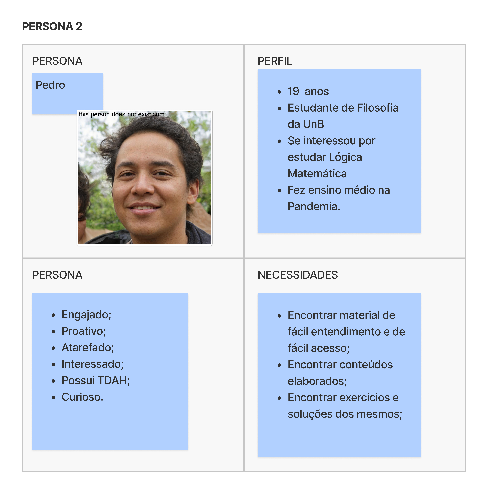
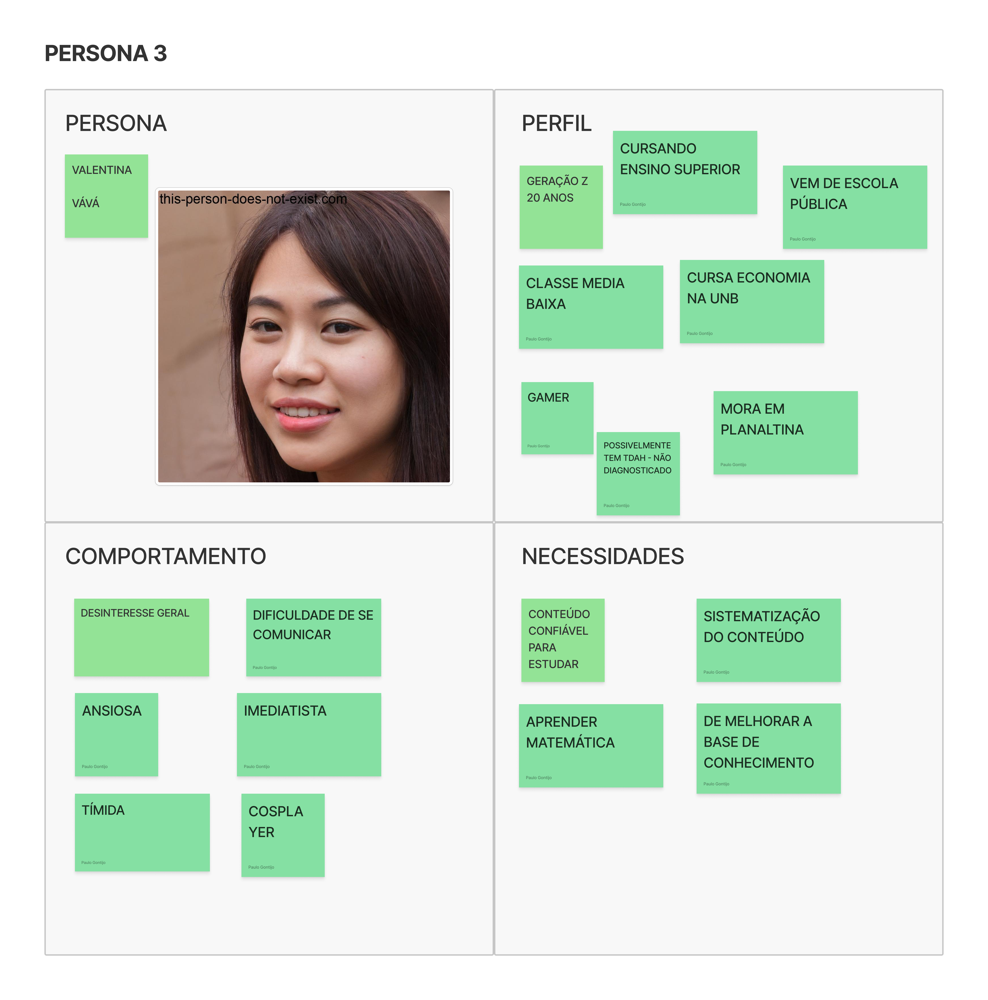
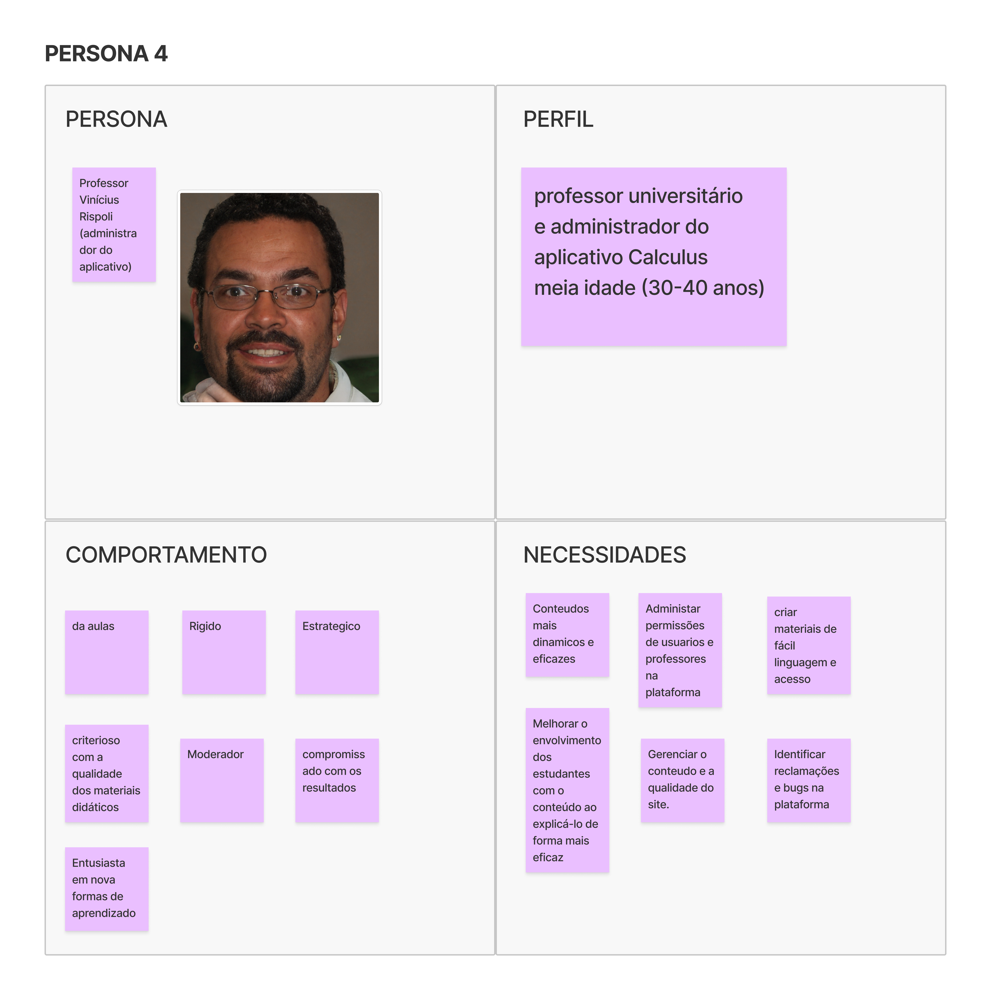

# Personas

## 1. Definição

A atividade de definição de Personas visa identificar de forma eficaz as funcionalidades de um produto, utilizando personas para representar os usuários. Uma persona é uma representação fictícia de um usuário típico do produto ou serviço, descrevendo não apenas seu papel, mas também suas necessidades, comportamentos e objetivos específicos. Isso cria uma representação realista dos usuários, auxiliando a equipe a desenvolver funcionalidades a partir da perspectiva de quem irá interagir com o produto final.

Para esta dinâmica, dividimos nossa equipe em quatro grupos, o que resultou na concepção de quatro personas, sendo elas:

## 2. Resultado

### Professor Alberto 

### Pedro

### Valentina(Vává) 

### Professor Rispoli 

## 3. Referências

> Lean Inception - Como alinhar pessoas e construir o produto certo. Paulo Caroli.

## 4. Histórico de versão

|**Data**|**Descrição**|**Autor(es)**|
|--------|-------------|--------------|
|02/07/2024| Criação do Documento | Davi Matheus |
