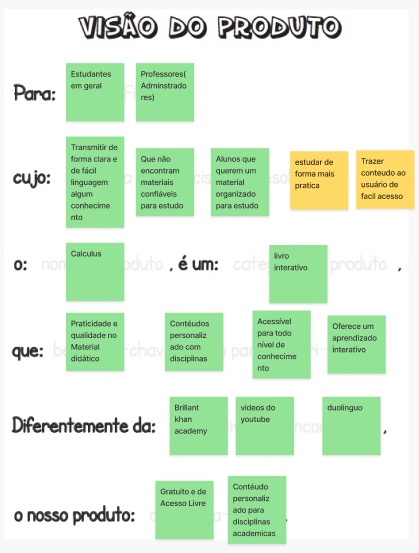

# Visão do Produto  

## 1. Definição

A etapa da visão do produto no Lean Inception desempenha um papel crucial na definição inicial do produto, fornecendo assim uma visão abrangente do produto e do seu valor.

Durante essa etapa, a equipe trabalha em conjunto de forma colaborativa, seguindo um template específico, com o objetivo de criar uma visão clara e compartilhada do produto em desenvolvimento.

### TEMPLATE

            Para [cliente final]

            Cujo [problema que precisa ser resolvido]

            O [nome do produto], é um [categoria do produto]

            Que [benefício chave, razão para adquiri-lo].

            Diferentemente da [alternativa da concorrência],

            O nosso produto [diferença chave].

## 2. Resultado

## 3. Referências

> Lean Inception - Como alinhar pessoas e construir o produto certo. Paulo Caroli.

## 4. Histórico de versão

|**Data**|**Descrição**|**Autor(es)**|
|--------|-------------|--------------|
|08/05/2024| Criação do Documento | Kauã Seichi |
