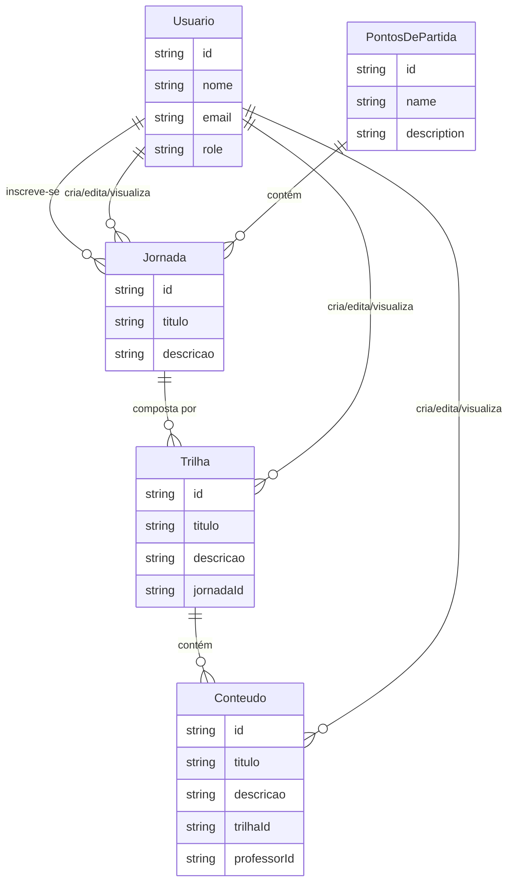
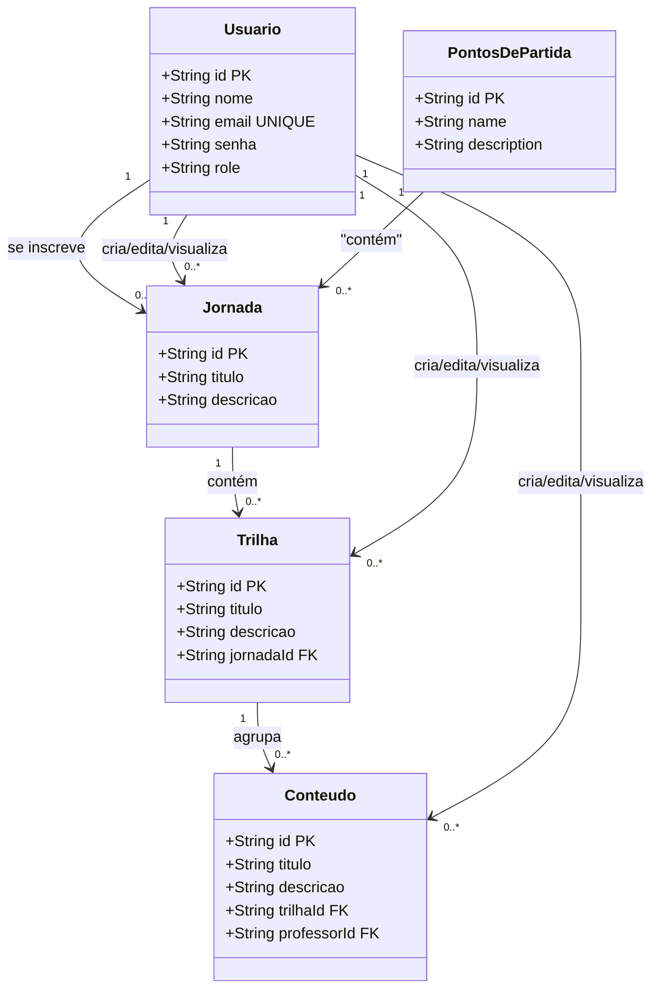
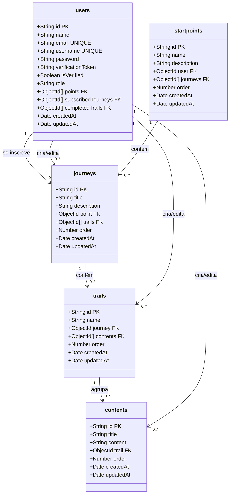
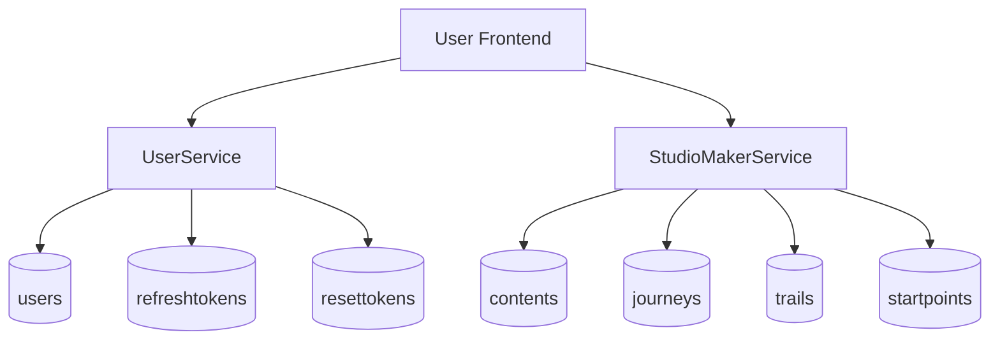
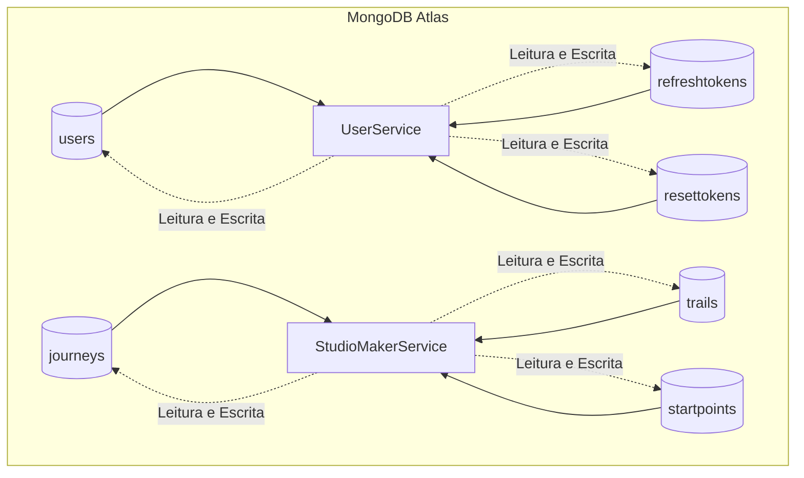
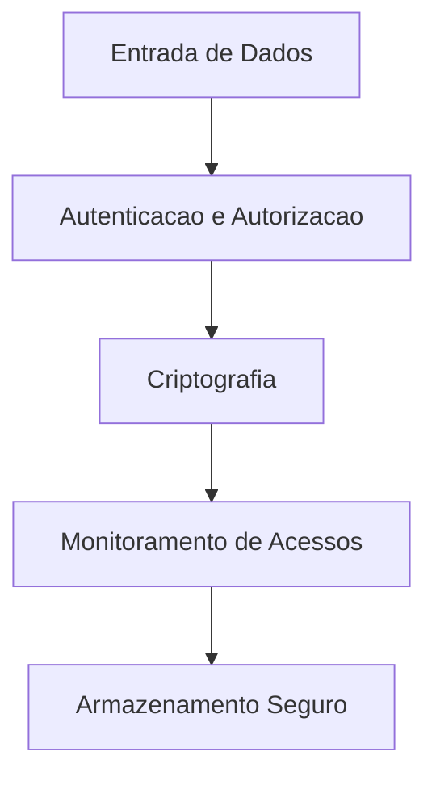
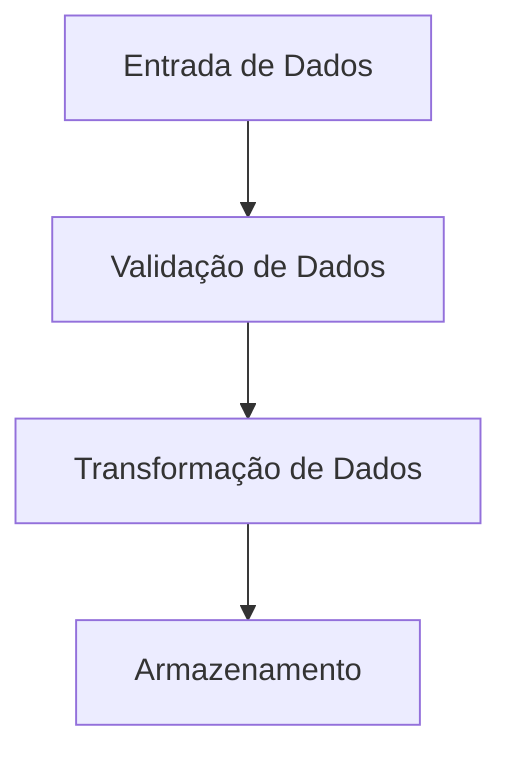

# Visão de Dados da Aplicação
***
## 1. Introdução
Este documento descreve a visão geral de dados da aplicação, abordando a estrutura dos dados, os fluxos de informação, as fontes de dados, os processos de transformação e armazenamento, além dos padrões de acesso e governança. O objetivo é garantir que todos os aspectos relacionados ao gerenciamento de dados na aplicação estejam bem documentados e compreendidos por todos os stakeholders.

***
## 2. Modelagem de Dados
### 2.1. Modelo Conceitual

O modelo conceitual do *Calculus* reflete a estrutura de dados fundamental que conecta conteúdos educacionais a alunos, com base em uma hierarquia que organiza as aulas em **Jornadas**, **Trilhas**, e **Conteúdos**. O sistema distingue entre diferentes tipos de usuários (Alunos, Professores, e Administradores), cada um com permissões específicas. Professores são os únicos que podem criar e editar conteúdos, enquanto alunos podem se inscrever em jornadas e acessar conteúdos, mas não podem modificá-los.

#### Entidades e Relacionamentos:

- **Usuário**: Representa qualquer pessoa com uma conta na plataforma. Os usuários têm papéis específicos: **Aluno**, **Professor**, e **Administrador**. Professores criam e editam conteúdos, enquanto alunos consomem os conteúdos dentro das jornadas em que estão inscritos.

- **Jornada**: O maior nível na hierarquia educacional, composto por múltiplas trilhas. Alunos podem se inscrever em jornadas.

- **Trilha**: Um conjunto de conteúdos organizados dentro de uma jornada. Trilhas agrupam conteúdos relacionados.

- **Conteúdo**: O nível mais granular, criado e gerido por professores, e consumido por alunos. Cada conteúdo pertence a uma trilha.

- **Pontos de Partida**: Um startpoint (ou "ponto de partida") pode ser definido como um marco inicial no aprendizado. Sua estrutura é tal que contém jornadas que contemplam o mesmo campo de estudo. 

**Autor:** Calculus Team

**Autor:** Calculus Team

#### Descrição

- **Jornada** é composta por várias **Trilhas**, que por sua vez contêm **Conteúdos**.
- **Usuários** desempenham diferentes funções (**Aluno**, **Professor**, **Administrador**), e suas interações com a plataforma são mediadas por suas permissões:
  - **Alunos** podem se inscrever em **Jornadas** e acessar todas as **Trilhas** dentro delas.
  - **Professores** criam e gerenciam **Conteúdos** dentro das **Trilhas** e **Jornadas** às quais estão associados.

### 2.2. Modelo Lógico

O modelo lógico detalha a estrutura de dados do *Calculus*, especificando as entidades, atributos, e os relacionamentos entre elas, com um foco maior nos detalhes técnicos, como chaves primárias e estrangeiras.

**Autor:** Calculus Team

#### Descrição

- **Usuario.role** define o tipo de usuário (Aluno, Professor, Administrador).
- **Inscricao** registra a participação de um aluno em uma jornada específica.
- **Conteudo** está sempre associado a um **Professor** (via **professorId**), que tem permissão para criar e editar o conteúdo.

### 2.3. Modelo Físico

O modelo físico traduz a lógica dos dados para a implementação real no banco de dados. Aplicado ao projeto do _Calculus_, a realidade é de uma modelagem não relacional, portanto trabalha-se com [Databases -> Collections -> Documents]. No diagrama abaixo pode-se visualizar a organização das nossas collections com o schema de um documento genérico:

> *OBS.: É importante ressaltar que cada Database refere-se a um ambiente (DEV, QAS e PRD).

**Autor:** Calculus Team

#### Descrição

- **users**: Armazena informações de login e funções dos usuários na plataforma.
- **journeys**, **trails**, **contents**: Tabelas que estruturam a hierarquia de conteúdos educacionais.

***
## 3. Arquitetura de Dados

A arquitetura de dados do projeto *Calculus* foi projetada para assegurar que a coleta, processamento e armazenamento de informações ocorram de maneira eficiente e segura. A aplicação gera dados a partir das interações dos usuários, que são processados por serviços dedicados e armazenados em collections específicas no MongoDB Atlas. Cada serviço possui suas próprias collections que estruturam os dados de maneira organizada.

### 3.1. Fluxo de Dados

No *Calculus*, os dados são gerados a partir das interações dos usuários no frontend, que envia requisições para serviços no backend. Esses serviços processam os dados e interagem com collections específicas no MongoDB para armazenamento e recuperação.

Descrição do Fluxo:

1. **Interação do Usuário**: Usuários (alunos, professores, ou administradores) interagem com a interface da aplicação, realizando ações como autenticação, criação de conteúdos, inscrição em jornadas, etc.
2. **Envio de Requisições**: Essas interações resultam em requisições que são enviadas para serviços específicos:
   - **UserService**: Gestão e autenticação de usuários, lidando com a criação e verificação de tokens de autenticação, além de gerenciar dados do usuário.
   - **StudioMakerService**: Criação, edição e gestão de conteúdos educacionais, incluindo a estruturação de jornadas, trilhas e conteúdos.
3. **Processamento e Armazenamento**: Os dados processados são então armazenados em collections dedicadas dentro do MongoDB Atlas, conforme o serviço correspondente.

Abaixo segue um diagrama que representa visualmente o conceito abordado acima:

**Autor:** Calculus Team

- **UserService** interage com as collections **users**, **refreshtokens**, e **resettokens**:
    - **users**: Armazena informações de usuários, como credenciais e perfis.
    - **refreshtokens**: Gera e armazena tokens usados para manter a sessão do usuário.
    - **resettokens**: Armazena tokens temporários para redefinição de senhas.

- **StudioMakerService** interage com as collections **contents**, **journeys**, **trails**, e **startpoints**:
    - **contents**: Armazena os materiais educacionais criados pelos professores.
    - **journeys**: Armazena informações sobre jornadas, que agrupam trilhas educacionais.
    - **trails**: Armazena trilhas, que são compostas por conteúdos.
    - **startpoints**: Registra pontos de partida ou progresso em trilhas e jornadas.

### 3.2. Fontes de Dados

As principais fontes de dados no *Calculus* são as interações dos usuários, que geram informações processadas e armazenadas nas collections do MongoDB. A aplicação não depende de fontes externas; todos os dados são gerados e manipulados internamente pelos serviços.

- **UserService**: Gerencia dados relacionados a usuários, incluindo autenticação, roles (permissões de aluno, professor, administrador) e gerenciamento de tokens.
- **StudioMakerService**: Gerencia a criação e edição de conteúdos educacionais e a estruturação de jornadas e trilhas.

Cada serviço possui suas próprias collections no MongoDB, organizando os dados de forma eficiente e segura.

### 3.3. Armazenamento de Dados

O armazenamento dos dados no *Calculus* é realizado por meio de collections específicas em instâncias de MongoDB Atlas. Cada serviço possui suas próprias collections dedicadas para manter os dados organizados e seguros.

#### Estrutura de Armazenamento:
- **UserService**: Armazena dados relacionados a usuários e autenticação.
    - **users**: Dados do usuário, como credenciais e roles.
    - **refreshtokens**: Tokens de sessão do usuário.
    - **resettokens**: Tokens para redefinição de senhas.
  
- **StudioMakerService**: Armazena dados relacionados a conteúdos educacionais.
    - **contents**: Materiais educacionais criados pelos professores.
    - **journeys**: Estrutura de jornadas que agrupam trilhas.
    - **trails**: Conjunto de trilhas associadas às jornadas.
    - **startpoints**: Marca o progresso ou o início em trilhas e jornadas.

Abaixo segue um diagrama que resume o conceito apresentado visualmente:

**Autor:** Calculus Team

- Cada serviço (UserService, StudioMakerService) está conectado às suas respectivas collections no MongoDB Atlas.

Considerações de Armazenamento:

- **Isolamento**: Cada serviço tem suas próprias collections para evitar interferências e facilitar a manutenção.
- **Escalabilidade**: MongoDB Atlas permite o crescimento dos bancos de dados conforme a demanda da aplicação aumenta.
- **Segurança**: As interações com o MongoDB Atlas são realizadas de forma segura, requisitando autenticação válida para cada tipo de ação, garantindo que os dados estejam protegidos contra acessos não 

***
## 4. Governança de Dados

A governança de dados no *Calculus* é fundamental para garantir que todas as informações gerenciadas pela aplicação sejam tratadas de forma segura, precisa e conforme as regulamentações aplicáveis. A seção a seguir detalha as práticas de segurança, qualidade de dados, e conformidade implementadas no sistema.

### 4.1. Políticas de Segurança

As políticas de segurança do *Calculus* são desenhadas para proteger os dados contra acessos não autorizados, garantir a integridade das informações e assegurar a disponibilidade dos dados para os usuários legítimos.

- **Autenticação e Autorização**: Todos os acessos à aplicação são controlados por um sistema robusto de autenticação e autorização. Os usuários devem se autenticar via credenciais seguras, e os tokens de sessão são gerenciados através das collections **refreshtokens** e **resettokens** no MongoDB.
- **Criptografia**: Dados sensíveis, como senhas de usuário e tokens de autenticação, são criptografados  em repouso (armazenamento).
- **Backup e Recuperação**: Rotinas de backup são implementadas para garantir que os dados possam ser recuperados em caso de falha. O MongoDB Atlas oferece recursos avançados de backup e recuperação de desastres.

**Autor:** Calculus Team

### 4.2. Qualidade de Dados

A qualidade dos dados é essencial para garantir que as informações usadas pelos alunos e professores sejam precisas, completas e consistentes. O *Calculus* adota várias práticas para manter altos padrões de qualidade de dados.

- **Validação**: Todos os dados inseridos pelos usuários ou processados pelos serviços são validados para garantir que estejam no formato correto e dentro dos limites esperados. Por exemplo, os dados de **users**, **contents**, e **journeys** passam por validações de integridade antes de serem armazenados.
- **Consistência**: Garantir a consistência dos dados entre as diferentes collections é fundamental. Relacionamentos entre **journeys**, **trails**, e **contents** são verificados para assegurar que as referências cruzadas sejam válidas.

**Autor:** Calculus Team

## 5. Revisão Bibliográfica

> Inmon, W. H., Strauss, D., & Neushloss, G. (2010). *DW 2.0: The Architecture for the Next Generation of Data Warehousing*. Morgan Kaufmann.

> ISO/IEC 27001 (2013). *Information technology — Security techniques — Information security management systems — Requirements*.

## 6. Histórico de Versão

| Data       | Versão | Descrição                               | Autor(es)                            |
|------------|--------|-----------------------------------------|--------------------------------------|
| 01/09/2024 | 1.0    | Criação do documento                    | Paulo Gontijo                        |
| 05/09/2024 | 1.1    | Ajustes de texto e diagramas                    | Paulo Gontijo, João Bisinotti                        |