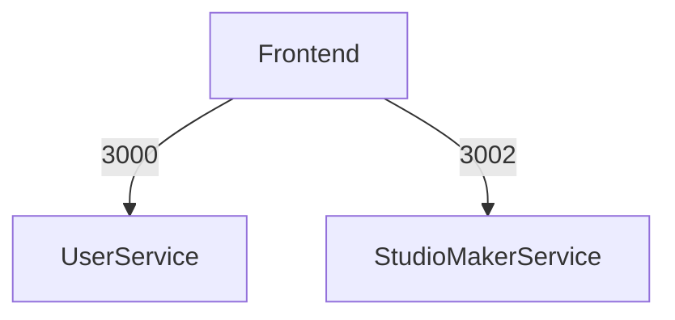

# Endpoints dos Serviços
***
## 1. Introdução

Este documento descreve os endpoints dos principais serviços da aplicação *Calculus*, incluindo suas rotas e portas. Os serviços estão segmentados de acordo com suas responsabilidades, como gestão de usuários e gestão de conteúdos. Cada serviço expõe uma série de endpoints RESTful que permitem a interação com a aplicação. Este documento é essencial para assegurar que os diferentes componentes do sistema possam se comunicar de forma eficaz.

***
## 2. UserService

O **UserService** é responsável pela gestão e autenticação dos usuários na plataforma *Calculus*. Este serviço lida com operações como registro, login, gerenciamento de tokens e redefinição de senha.

### 2.1. Endpoints

| Método | Rota                  | Descrição                                           |
|--------|-----------------------|-----------------------------------------------------|
| POST   | `/api/v1/users/register` | Registro de novos usuários na plataforma            |
| POST   | `/api/v1/users/login`    | Autenticação de usuários                            |
| POST   | `/api/v1/users/token`    | Geração de novos tokens de acesso                   |
| POST   | `/api/v1/users/reset`    | Solicitação de redefinição de senha                 |
| GET    | `/api/v1/users/me`       | Recupera as informações do usuário autenticado      |

### 2.2. Configuração de Porta

O **UserService** opera na porta **3000**. Todas as requisições a esse serviço devem ser direcionadas para essa porta no servidor onde o serviço está hospedado.

```yaml
Host: calculus-dev.eastus2.cloudapp.azure.com
Port: 3000
```

***
## 3. StudioMakerService

O **StudioMakerService** é responsável pela criação, edição e gestão dos conteúdos educacionais, incluindo a organização de jornadas e trilhas. Professores utilizam este serviço para gerenciar o conteúdo que será consumido pelos alunos.

### 3.1. Endpoints

| Método | Rota                               | Descrição                                                      |
|--------|------------------------------------|----------------------------------------------------------------|
| POST   | `/api/v1/contents`                 | Criação de novos conteúdos                                     |
| GET    | `/api/v1/contents/:id`             | Recupera um conteúdo específico pelo ID                        |
| PUT    | `/api/v1/contents/:id`             | Atualiza um conteúdo existente                                 |
| DELETE | `/api/v1/contents/:id`             | Remove um conteúdo existente                                   |
| GET    | `/api/v1/journeys`                 | Recupera todas as jornadas                                     |
| POST   | `/api/v1/journeys`                 | Criação de novas jornadas                                      |
| GET    | `/api/v1/journeys/:id`             | Recupera uma jornada específica pelo ID                        |
| PUT    | `/api/v1/journeys/:id`             | Atualiza uma jornada existente                                 |
| DELETE | `/api/v1/journeys/:id`             | Remove uma jornada existente                                   |
| GET    | `/api/v1/trails`                   | Recupera todas as trilhas                                      |
| POST   | `/api/v1/trails`                   | Criação de novas trilhas                                       |
| GET    | `/api/v1/trails/:id`               | Recupera uma trilha específica pelo ID                         |
| PUT    | `/api/v1/trails/:id`               | Atualiza uma trilha existente                                  |
| DELETE | `/api/v1/trails/:id`               | Remove uma trilha existente                                    |
| GET    | `/api/v1/startpoints`              | Recupera todos os pontos de partida                            |
| POST   | `/api/v1/startpoints`              | Criação de novos pontos de partida                             |
| GET    | `/api/v1/startpoints/:id`          | Recupera um ponto de partida específico pelo ID                |
| PUT    | `/api/v1/startpoints/:id`          | Atualiza um ponto de partida existente                         |
| DELETE | `/api/v1/startpoints/:id`          | Remove um ponto de partida existente                           |

### 3.2. Configuração de Porta

O **StudioMakerService** opera na porta **3002**. As requisições destinadas à criação e gestão de conteúdos educacionais devem ser direcionadas para essa porta.

```yaml
Host: calculus-dev.eastus2.cloudapp.azure.com
Port: 3002
```
***
## 4. Frontend

O **Frontend** da aplicação *Calculus* é responsável por fornecer a interface com a qual os usuários interagem. Ele se comunica com os serviços backend (**UserService** e **StudioMakerService**) para fornecer funcionalidades como autenticação, visualização e gestão de conteúdos educacionais. Esta seção descreve as rotas principais do frontend e a configuração da porta onde ele é servido.

### 4.1. Rotas

O **Frontend** utiliza várias rotas para organizar as diferentes páginas e funcionalidades acessíveis aos usuários:

| Rota                    | Descrição                                                                 |
|-------------------------|---------------------------------------------------------------------------|
| `/`                     | Página inicial da aplicação                                               |
| `/login`                | Página de login para autenticação de usuários                             |
| `/register`             | Página de registro para novos usuários                                    |
| `/dashboard`            | Dashboard do usuário autenticado                                          |
| `/contents`             | Página para visualização e gestão dos conteúdos                           |
| `/journeys`             | Página para visualização e gestão de jornadas                             |
| `/trails`               | Página para visualização e gestão de trilhas                              |
| `/contents/:id`         | Página para visualização detalhada de um conteúdo específico              |
| `/journeys/:id`         | Página para visualização detalhada de uma jornada específica              |
| `/trails/:id`           | Página para visualização detalhada de uma trilha específica               |
| `/profile`              | Página de perfil do usuário, para visualização e edição das informações pessoais |

### 4.2. Configuração de Porta

O **Frontend** da aplicação é servido na porta **4000**. Os usuários acessam a interface do *Calculus* através desta porta.

```yaml
Host: calculus-dev.eastus2.cloudapp.azure.com
Port: 4000
```

### 4.3. Comunicação com Backend

O **Frontend** se comunica com os serviços backend (**UserService** e **StudioMakerService**) através de chamadas HTTP/HTTPS. Todas as interações, como autenticação e gerenciamento de conteúdos, são realizadas via APIs RESTful fornecidas pelos serviços backend.

<center>

**Autor:** Calculus Team

</center>

***
## 5. Segurança dos Endpoints

Todos os endpoints expostos pelos serviços do *Calculus* são protegidos por mecanismos de autenticação e autorização. Apenas usuários autenticados podem acessar os endpoints que manipulam dados sensíveis ou críticos. Tokens de autenticação, gerenciados pelo **UserService**, são necessários para acessar a maioria das rotas, garantindo que somente usuários autorizados possam realizar operações.

## 6. Histórico de Versão

| Data       | Versão | Descrição                               | Autor(es)                             |
|------------|--------|-----------------------------------------|---------------------------------------|
| 01/09/2024 | 1.0    | Criação do documento                    | Paulo Gontijo                         |
