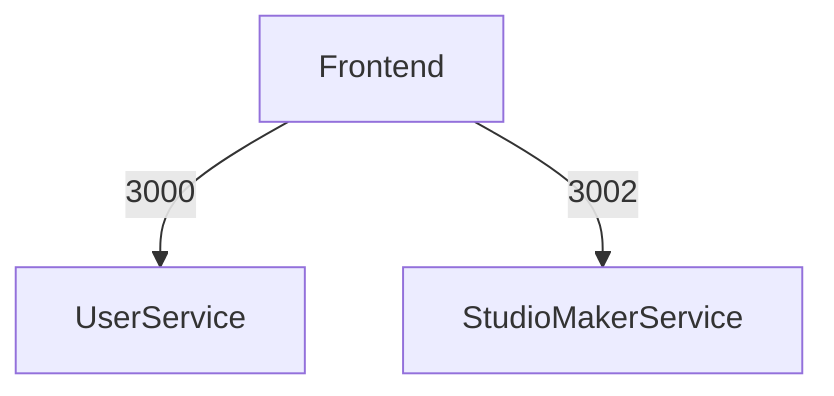

# Endpoints dos Serviços
***
## 1. Introdução

Este documento descreve os endpoints dos principais serviços da aplicação *Calculus*, incluindo suas rotas e portas. Os serviços estão segmentados de acordo com suas responsabilidades, como gestão de usuários e gestão de conteúdos. Cada serviço expõe uma série de endpoints RESTful que permitem a interação com a aplicação. Este documento é essencial para assegurar que os diferentes componentes do sistema possam se comunicar de forma eficaz.

***
## 2. UserService

O **UserService** é responsável pela gestão e autenticação dos usuários na plataforma *Calculus*. Este serviço lida com operações como registro, login, gerenciamento de tokens e redefinição de senha.

### 2.1. Endpoints

| Método | Rota                                     | Descrição                                                      |
|--------|------------------------------------------|----------------------------------------------------------------|
| POST   | `/api/v1/users`                          | Criação de um novo usuário                                      |
| GET    | `/api/v1/users/verify`                   | Verificação de conta de usuário por token                       |
| GET    | `/api/v1/users/:userId/subscribedJourneys` | Recupera as jornadas inscritas do usuário                       |
| GET    | `/api/v1/users`                          | Lista todos os usuários                                         |
| PATCH  | `/api/v1/users/:id/add-point`            | Adiciona um ponto ao usuário                                    |
| POST   | `/api/v1/users/:userId/subscribe/:journeyId` | Inscreve o usuário em uma jornada                              |
| DELETE | `/api/v1/users/:userId/unsubscribe/:journeyId` | Remove o usuário de uma jornada                                |
| POST   | `/api/v1/users/:userId/complete/:trailId` | Marca uma trilha como completa para o usuário                   |
| GET    | `/api/v1/users/:userId/completedTrails`   | Recupera as trilhas completadas do usuário                      |
| GET    | `/api/v1/users/:id`                      | Recupera informações de um usuário específico                   |
| DELETE | `/api/v1/users/:id`                      | Deleta um usuário específico                                    |
| PATCH  | `/api/v1/users/:id/role`                 | Atualiza o papel de um usuário (requer permissão de administrador) |
| POST   | `/api/v1/auth/login`                     | Autenticação de usuário (login)                                 |
| GET    | `/api/v1/auth/google`                    | Inicia autenticação com Google                                  |
| GET    | `/api/v1/auth/google/callback`           | Callback da autenticação com Google                             |
| GET    | `/api/v1/auth/microsoft`                 | Inicia autenticação com Microsoft                               |
| GET    | `/api/v1/auth/microsoft/callback`        | Callback da autenticação com Microsoft                          |
| GET    | `/api/v1/auth/validate-token`            | Valida um token de acesso                                       |
| POST   | `/api/v1/auth/refresh`                   | Geração de um novo token de acesso através de um refresh token  |
| PUT    | `/api/v1/auth/change-password`           | Troca a senha do usuário autenticado                            |
| POST   | `/api/v1/auth/forgot-password`           | Solicita redefinição de senha                                   |
| PUT    | `/api/v1/auth/reset-password`            | Reseta a senha do usuário                                       |

### 2.2. Configuração de Porta

O **UserService** opera na porta **3000**. Todas as requisições a esse serviço devem ser direcionadas para essa porta no servidor onde o serviço está hospedado.

```yaml
Host: calculus-dev.eastus2.cloudapp.azure.com
Port: 3000
```

***
## 3. StudioMakerService

O **StudioMakerService** é responsável pela criação, edição e gestão dos conteúdos educacionais, incluindo a organização de jornadas e trilhas. Professores utilizam este serviço para gerenciar o conteúdo que será consumido pelos alunos.

### 3.1. Endpoints

| Método | Rota                                     | Descrição                                                        |
|--------|------------------------------------------|------------------------------------------------------------------|
| POST   | `/api/v1/contents`                       | Criação de um novo conteúdo                                      |
| GET    | `/api/v1/contents/:id`                   | Recupera um conteúdo pelo ID                                     |
| GET    | `/api/v1/contents`                       | Lista todos os conteúdos                                         |
| GET    | `/api/v1/contents/trail/:id`             | Recupera todos os conteúdos de uma trilha                        |
| PATCH  | `/api/v1/contents/:id`                   | Atualiza um conteúdo pelo ID                                     |
| DELETE | `/api/v1/contents/:id`                   | Exclui um conteúdo pelo ID                                       |
| PATCH  | `/api/v1/contents/order/update-order`    | Atualiza a ordem dos conteúdos                                   |
| POST   | `/api/v1/trails`                         | Criação de uma nova trilha                                       |
| GET    | `/api/v1/trails/:id`                     | Recupera uma trilha pelo ID                                      |
| GET    | `/api/v1/trails`                         | Lista todas as trilhas                                           |
| GET    | `/api/v1/trails/journey/:id`             | Recupera todas as trilhas de uma jornada                         |
| PUT    | `/api/v1/trails/:id`                     | Atualiza uma trilha pelo ID                                      |
| PUT    | `/api/v1/trails/:id/addContent`          | Adiciona um conteúdo a uma trilha                                |
| PUT    | `/api/v1/trails/:id/removeContent`       | Remove um conteúdo de uma trilha                                 |
| DELETE | `/api/v1/trails/:id`                     | Exclui uma trilha pelo ID                                        |
| PATCH  | `/api/v1/trails/update-trail-order`      | Atualiza a ordem das trilhas                                     |
| POST   | `/api/v1/journeys`                       | Criação de uma nova jornada                                      |
| GET    | `/api/v1/journeys`                       | Lista todas as jornadas                                          |
| GET    | `/api/v1/journeys/point/:id`             | Recupera as jornadas associadas a um ponto                       |
| GET    | `/api/v1/journeys/:id`                   | Recupera uma jornada pelo ID                                     |
| PUT    | `/api/v1/journeys/:id`                   | Atualiza uma jornada pelo ID                                     |
| DELETE | `/api/v1/journeys/:id`                   | Exclui uma jornada pelo ID                                       |
| PATCH  | `/api/v1/journeys/:id/add-trail`         | Adiciona uma trilha a uma jornada                                |
| PATCH  | `/api/v1/journeys/update-journeys-order` | Atualiza a ordem das jornadas                                    |
| POST   | `/api/v1/points`                         | Criação de um novo ponto                                         |
| GET    | `/api/v1/points`                         | Lista todos os pontos                                            |
| GET    | `/api/v1/points/user/:id`                | Recupera os pontos associados a um usuário                       |
| GET    | `/api/v1/points/:id`                     | Recupera um ponto pelo ID                                        |
| PUT    | `/api/v1/points/:id`                     | Atualiza um ponto pelo ID                                        |
| DELETE | `/api/v1/points/:id`                     | Exclui um ponto pelo ID                                          |
| PATCH  | `/api/v1/points/:id/add-journey`         | Adiciona uma jornada a um ponto                                  |
| GET    | `/api/v1/points/:pointId/journeys`       | Recupera as jornadas associadas a um ponto                       |
| PATCH  | `/api/v1/points/update-point-order`      | Atualiza a ordem dos pontos                                      |

### 3.2. Configuração de Porta

O **StudioMakerService** opera na porta **3002**. As requisições destinadas à criação e gestão de conteúdos educacionais devem ser direcionadas para essa porta.

```yaml
Host: calculus-dev.eastus2.cloudapp.azure.com
Port: 3002
```
***
## 4. Frontend

O **Frontend** da aplicação *Calculus* é responsável por fornecer a interface com a qual os usuários interagem. Ele se comunica com os serviços backend (**UserService** e **StudioMakerService**) para fornecer funcionalidades como autenticação, visualização e gestão de conteúdos educacionais. Esta seção descreve as rotas principais do frontend e a configuração da porta onde ele é servido.

### 4.1. Configuração de Porta

O **Frontend** da aplicação é servido na porta **4000**. Os usuários acessam a interface do *Calculus* através desta porta.

```yaml
Host: calculus-dev.eastus2.cloudapp.azure.com
Port: 4000
```

### 4.2. Comunicação com Backend

O **Frontend** se comunica com os serviços backend (**UserService** e **StudioMakerService**) através de chamadas HTTP/HTTPS. Todas as interações, como autenticação e gerenciamento de conteúdos, são realizadas via APIs RESTful fornecidas pelos serviços backend.

<center>

**Autor:** Calculus Team

</center>

***
## 5. Segurança dos Endpoints

Todos os endpoints expostos pelos serviços do *Calculus* são protegidos por mecanismos de autenticação e autorização. Apenas usuários autenticados podem acessar os endpoints que manipulam dados sensíveis ou críticos. Tokens de autenticação, gerenciados pelo **UserService**, são necessários para acessar a maioria das rotas, garantindo que somente usuários autorizados possam realizar operações.

## 6. Histórico de Versão

| Data       | Versão | Descrição                               | Autor(es)                             |
|------------|--------|-----------------------------------------|---------------------------------------|
| 01/09/2024 | 1.0    | Criação do documento                    | Paulo Gontijo                         |
| 05/09/2024 | 1.1    | Adicionando mais endpoints                    | Paulo Gontijo                         |
